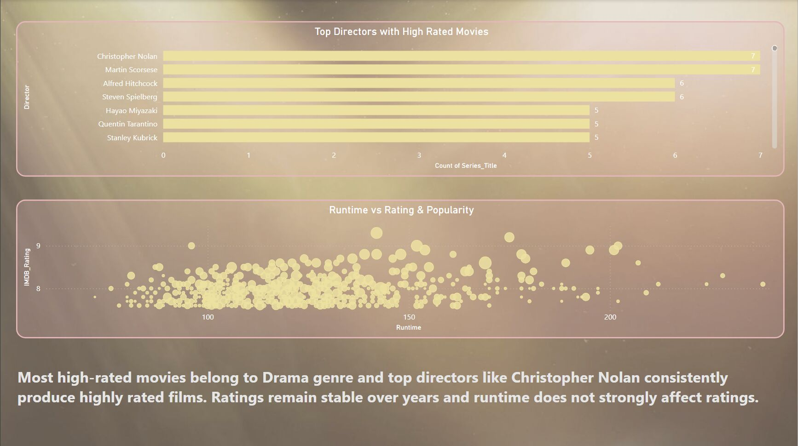
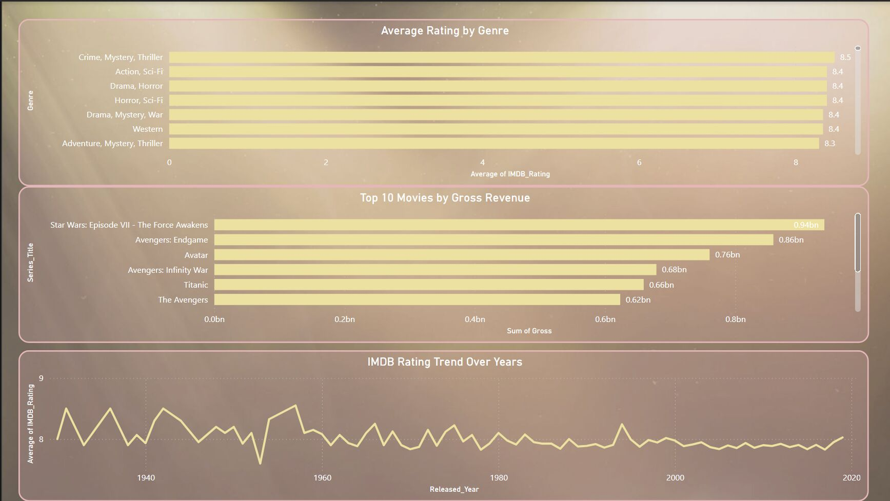
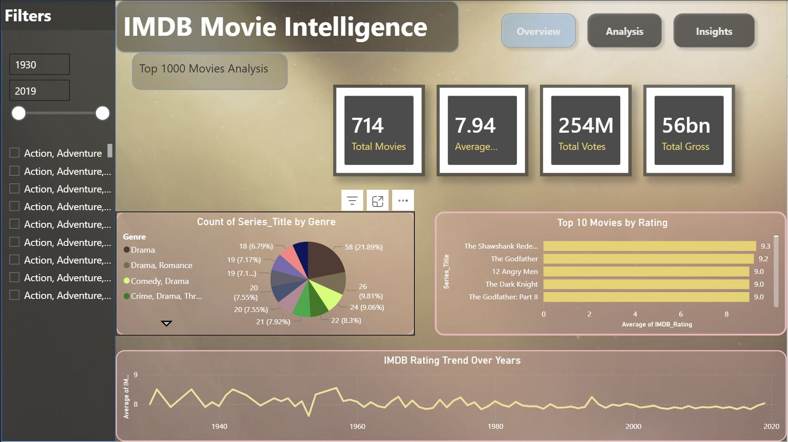

# IMDb Data Analysis

This project analyzes the **IMDb Top 1000 Movies dataset** using Python and Power BI to identify trends and insights related to movie ratings, genres, directors, votes, and release years.

## Features

- Top-rated movies analysis
- Genre analysis
- Rating distribution
- Votes vs. IMDb rating analysis using Linear Regression
- Director analysis
- Year-wise movie trends
- Interactive Power BI dashboard

## Tools & Technologies

- Python
- Pandas
- Matplotlib
- Scikit-learn
- Power BI
- Linear Regression

## Dataset

The project uses the **IMDb Top 1000 Movies dataset**, containing information such as:

- Movie titles
- IMDb ratings
- Number of votes
- Genres
- Directors
- Release years

## Python Data Analysis

The Python analysis includes:

- Data cleaning and preprocessing
- Exploratory Data Analysis (EDA)
- Top-rated movie analysis
- Genre analysis
- Rating distribution
- Director analysis
- Year-wise trends
- Votes vs. IMDb rating analysis
- Linear Regression

## Power BI Dashboard

An interactive **Power BI dashboard** was created to visualize the IMDb Top 1000 Movies dataset and present key insights.

### Dashboard Preview



### Rating Analysis



### Additional Analysis



### Download Power BI Dashboard

[Download IMDb Power BI Dashboard](powerBi/IMDb_Top_1000_Dashboard.pbix)

## Python Analysis Screenshots

### Top Movies


### Genres


### Ratings


### Votes vs Rating


## How to Run

### 1. Clone the repository

```bash
git clone https://github.com/Hannibal-Lectar/imdb-analysis.git
